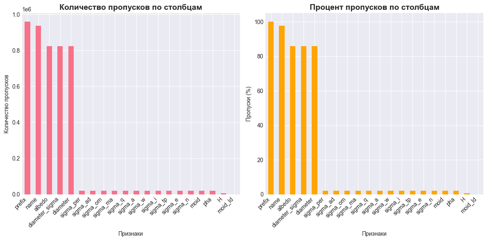
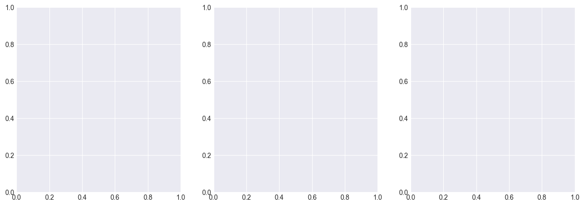
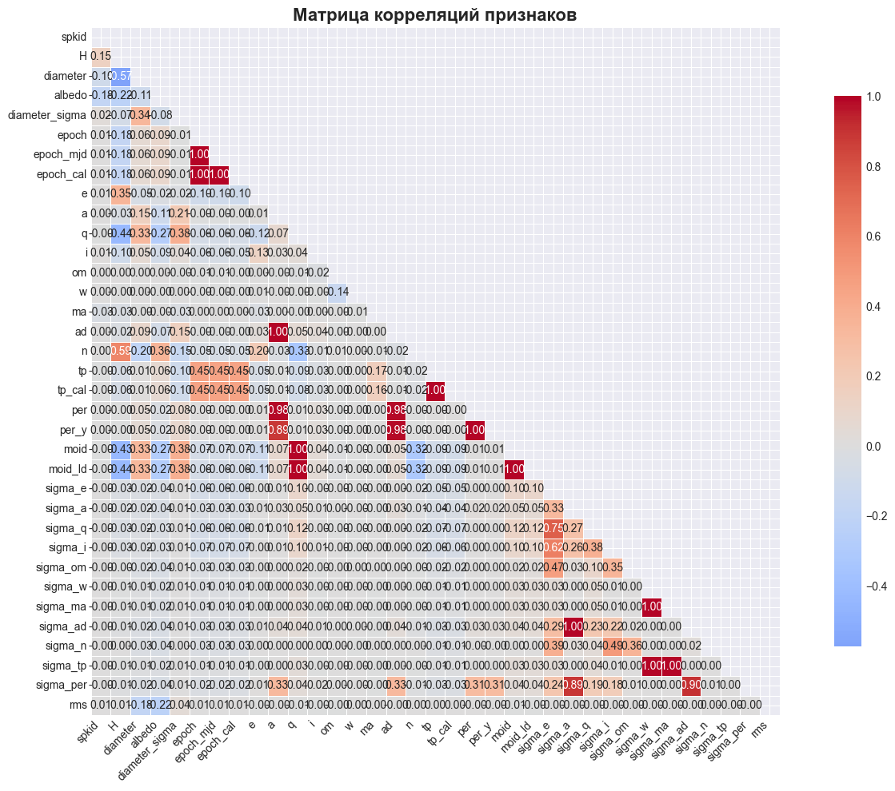
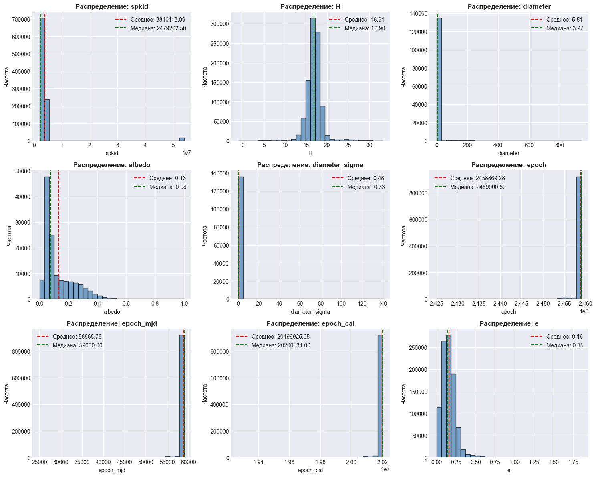
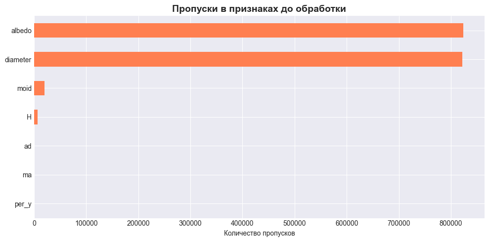
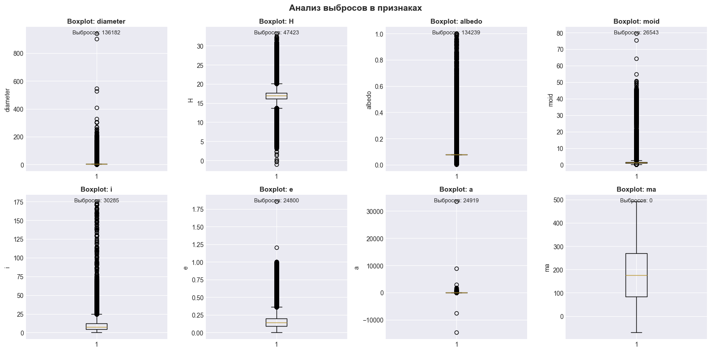
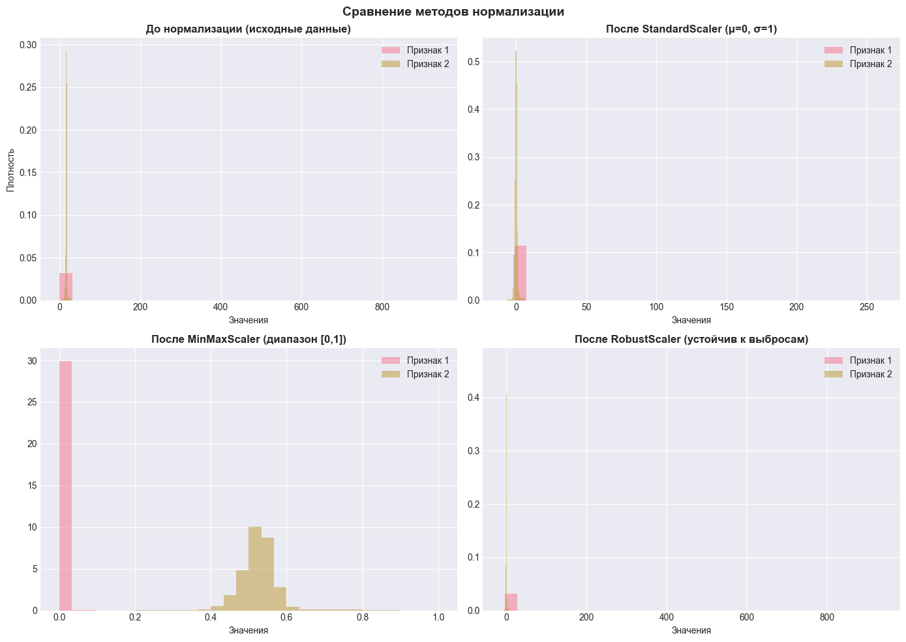

```python
import pandas as pd
import numpy as np
import matplotlib.pyplot as plt
import seaborn as sns
from sklearn.model_selection import train_test_split, cross_val_score, GridSearchCV
from sklearn.neighbors import KNeighborsClassifier
from sklearn.metrics import (accuracy_score, classification_report, confusion_matrix, 
                             roc_curve, auc, precision_recall_curve, ConfusionMatrixDisplay)
from sklearn.preprocessing import StandardScaler, MinMaxScaler, RobustScaler
from sklearn.feature_selection import SelectKBest, f_classif, mutual_info_classif, RFE
from sklearn.decomposition import PCA
from sklearn.pipeline import Pipeline
import warnings
warnings.filterwarnings('ignore')

# Настройка стиля графиков
plt.style.use('seaborn-v0_8-darkgrid')
sns.set_palette("husl")
```


```python
df = pd.read_csv("dataset.csv")

```


```python
print(f"\n Размер датасета: {df.shape[0]} строк, {df.shape[1]} столбцов")
print(f"\n Столбцы:\n{df.columns.tolist()}")
```

    
     Размер датасета: 958524 строк, 45 столбцов
    
     Столбцы:
    ['id', 'spkid', 'full_name', 'pdes', 'name', 'prefix', 'neo', 'pha', 'H', 'diameter', 'albedo', 'diameter_sigma', 'orbit_id', 'epoch', 'epoch_mjd', 'epoch_cal', 'equinox', 'e', 'a', 'q', 'i', 'om', 'w', 'ma', 'ad', 'n', 'tp', 'tp_cal', 'per', 'per_y', 'moid', 'moid_ld', 'sigma_e', 'sigma_a', 'sigma_q', 'sigma_i', 'sigma_om', 'sigma_w', 'sigma_ma', 'sigma_ad', 'sigma_n', 'sigma_tp', 'sigma_per', 'class', 'rms']
    


```python
print("\n Информация о данных:")
df_info = pd.DataFrame({
    'Тип данных': df.dtypes,
    'Пропуски (%)': (df.isnull().sum() / len(df) * 100).round(2),
    'Уникальные значения': df.nunique()
})
print(df_info)
```

    
     Информация о данных:
                   Тип данных  Пропуски (%)  Уникальные значения
    id                 object          0.00               958524
    spkid               int64          0.00               958524
    full_name          object          0.00               958524
    pdes               object          0.00               958524
    name               object         97.70                22064
    prefix             object        100.00                    1
    neo                object          0.00                    2
    pha                object          2.08                    2
    H                 float64          0.65                 9489
    diameter          float64         85.79                16591
    albedo            float64         85.91                 1057
    diameter_sigma    float64         85.80                 3054
    orbit_id           object          0.00                 4690
    epoch             float64          0.00                 5246
    epoch_mjd           int64          0.00                 5246
    epoch_cal         float64          0.00                 5246
    equinox            object          0.00                    1
    e                 float64          0.00               958444
    a                 float64          0.00               958509
    q                 float64          0.00               958509
    i                 float64          0.00               958414
    om                float64          0.00               958518
    w                 float64          0.00               958519
    ma                float64          0.00               958519
    ad                float64          0.00               958505
    n                 float64          0.00               958514
    tp                float64          0.00               958519
    tp_cal            float64          0.00               958499
    per               float64          0.00               958510
    per_y             float64          0.00               958511
    moid              float64          2.08               314300
    moid_ld           float64          0.01               314301
    sigma_e           float64          2.08               254740
    sigma_a           float64          2.08               273297
    sigma_q           float64          2.08               248138
    sigma_i           float64          2.08               215741
    sigma_om          float64          2.08               223155
    sigma_w           float64          2.08               262719
    sigma_ma          float64          2.08               266816
    sigma_ad          float64          2.08               269241
    sigma_n           float64          2.08               251750
    sigma_tp          float64          2.08               291246
    sigma_per         float64          2.08               282687
    class              object          0.00                   13
    rms               float64          0.00                64386
    


```python
print("\n Статистика числовых признаков:")
display(df.describe())
```

    
     Статистика числовых признаков:
    


<div>
<style scoped>
    .dataframe tbody tr th:only-of-type {
        vertical-align: middle;
    }

    .dataframe tbody tr th {
        vertical-align: top;
    }

    .dataframe thead th {
        text-align: right;
    }
</style>
<table border="1" class="dataframe">
  <thead>
    <tr style="text-align: right;">
      <th></th>
      <th>spkid</th>
      <th>H</th>
      <th>diameter</th>
      <th>albedo</th>
      <th>diameter_sigma</th>
      <th>epoch</th>
      <th>epoch_mjd</th>
      <th>epoch_cal</th>
      <th>e</th>
      <th>a</th>
      <th>...</th>
      <th>sigma_q</th>
      <th>sigma_i</th>
      <th>sigma_om</th>
      <th>sigma_w</th>
      <th>sigma_ma</th>
      <th>sigma_ad</th>
      <th>sigma_n</th>
      <th>sigma_tp</th>
      <th>sigma_per</th>
      <th>rms</th>
    </tr>
  </thead>
  <tbody>
    <tr>
      <th>count</th>
      <td>9.585240e+05</td>
      <td>952261.000000</td>
      <td>136209.000000</td>
      <td>135103.000000</td>
      <td>136081.000000</td>
      <td>9.585240e+05</td>
      <td>958524.000000</td>
      <td>9.585240e+05</td>
      <td>958524.000000</td>
      <td>958524.000000</td>
      <td>...</td>
      <td>9.386020e+05</td>
      <td>9.386020e+05</td>
      <td>9.386020e+05</td>
      <td>9.386020e+05</td>
      <td>9.386020e+05</td>
      <td>9.385980e+05</td>
      <td>9.386020e+05</td>
      <td>9.386020e+05</td>
      <td>9.385980e+05</td>
      <td>958522.000000</td>
    </tr>
    <tr>
      <th>mean</th>
      <td>3.810114e+06</td>
      <td>16.906411</td>
      <td>5.506429</td>
      <td>0.130627</td>
      <td>0.479184</td>
      <td>2.458869e+06</td>
      <td>58868.781950</td>
      <td>2.019693e+07</td>
      <td>0.156116</td>
      <td>2.902143</td>
      <td>...</td>
      <td>1.982929e+01</td>
      <td>1.168449e+00</td>
      <td>5.310234e+00</td>
      <td>1.370062e+06</td>
      <td>1.369977e+06</td>
      <td>2.131453e+01</td>
      <td>5.060221e-02</td>
      <td>4.312780e+08</td>
      <td>8.525815e+04</td>
      <td>0.561153</td>
    </tr>
    <tr>
      <th>std</th>
      <td>6.831541e+06</td>
      <td>1.790405</td>
      <td>9.425164</td>
      <td>0.110323</td>
      <td>0.782895</td>
      <td>7.016716e+02</td>
      <td>701.671573</td>
      <td>1.930354e+04</td>
      <td>0.092643</td>
      <td>39.719503</td>
      <td>...</td>
      <td>2.903785e+03</td>
      <td>1.282231e+02</td>
      <td>1.333381e+03</td>
      <td>9.158996e+08</td>
      <td>9.158991e+08</td>
      <td>7.197034e+03</td>
      <td>9.814953e+00</td>
      <td>2.953046e+11</td>
      <td>2.767681e+07</td>
      <td>2.745700</td>
    </tr>
    <tr>
      <th>min</th>
      <td>2.000001e+06</td>
      <td>-1.100000</td>
      <td>0.002500</td>
      <td>0.001000</td>
      <td>0.000500</td>
      <td>2.425052e+06</td>
      <td>25051.000000</td>
      <td>1.927062e+07</td>
      <td>0.000000</td>
      <td>-14702.447872</td>
      <td>...</td>
      <td>1.956900e-11</td>
      <td>4.608900e-09</td>
      <td>6.168800e-08</td>
      <td>6.624800e-08</td>
      <td>7.820700e-09</td>
      <td>1.111300e-11</td>
      <td>1.196500e-12</td>
      <td>3.782900e-08</td>
      <td>9.415900e-09</td>
      <td>0.000000</td>
    </tr>
    <tr>
      <th>25%</th>
      <td>2.239632e+06</td>
      <td>16.100000</td>
      <td>2.780000</td>
      <td>0.053000</td>
      <td>0.180000</td>
      <td>2.459000e+06</td>
      <td>59000.000000</td>
      <td>2.020053e+07</td>
      <td>0.092193</td>
      <td>2.387835</td>
      <td>...</td>
      <td>1.462000e-07</td>
      <td>6.095900e-06</td>
      <td>3.619400e-05</td>
      <td>5.755000e-05</td>
      <td>2.573700e-05</td>
      <td>2.340900e-08</td>
      <td>2.768800e-09</td>
      <td>1.110900e-04</td>
      <td>1.794500e-05</td>
      <td>0.518040</td>
    </tr>
    <tr>
      <th>50%</th>
      <td>2.479262e+06</td>
      <td>16.900000</td>
      <td>3.972000</td>
      <td>0.079000</td>
      <td>0.332000</td>
      <td>2.459000e+06</td>
      <td>59000.000000</td>
      <td>2.020053e+07</td>
      <td>0.145002</td>
      <td>2.646969</td>
      <td>...</td>
      <td>2.271900e-07</td>
      <td>8.688800e-06</td>
      <td>6.642550e-05</td>
      <td>1.047100e-04</td>
      <td>4.900100e-05</td>
      <td>4.359000e-08</td>
      <td>4.638000e-09</td>
      <td>2.230800e-04</td>
      <td>3.501700e-05</td>
      <td>0.566280</td>
    </tr>
    <tr>
      <th>75%</th>
      <td>3.752518e+06</td>
      <td>17.714000</td>
      <td>5.765000</td>
      <td>0.190000</td>
      <td>0.620000</td>
      <td>2.459000e+06</td>
      <td>59000.000000</td>
      <td>2.020053e+07</td>
      <td>0.200650</td>
      <td>3.001932</td>
      <td>...</td>
      <td>6.583200e-07</td>
      <td>1.591500e-05</td>
      <td>1.609775e-04</td>
      <td>3.114400e-04</td>
      <td>1.718900e-04</td>
      <td>1.196600e-07</td>
      <td>1.124000e-08</td>
      <td>8.139600e-04</td>
      <td>9.775475e-05</td>
      <td>0.613927</td>
    </tr>
    <tr>
      <th>max</th>
      <td>5.401723e+07</td>
      <td>33.200000</td>
      <td>939.400000</td>
      <td>1.000000</td>
      <td>140.000000</td>
      <td>2.459000e+06</td>
      <td>59000.000000</td>
      <td>2.020053e+07</td>
      <td>1.855356</td>
      <td>33488.895955</td>
      <td>...</td>
      <td>1.015000e+06</td>
      <td>5.533000e+04</td>
      <td>1.199100e+06</td>
      <td>8.845100e+11</td>
      <td>8.845100e+11</td>
      <td>5.509700e+06</td>
      <td>7.698800e+03</td>
      <td>2.853100e+14</td>
      <td>1.910700e+10</td>
      <td>2686.600000</td>
    </tr>
  </tbody>
</table>
<p>8 rows × 35 columns</p>
</div>


```python
plt.figure(figsize=(12, 6))
plt.subplot(1, 2, 1)
df.isnull().sum().sort_values(ascending=False).head(20).plot(kind='bar')
plt.title('Количество пропусков по столбцам', fontsize=14, fontweight='bold')
plt.xlabel('Признаки')
plt.ylabel('Количество пропусков')
plt.xticks(rotation=45, ha='right')

plt.subplot(1, 2, 2)
missing_percent = (df.isnull().sum() / len(df) * 100).sort_values(ascending=False).head(20)
missing_percent.plot(kind='bar', color='orange')
plt.title('Процент пропусков по столбцам', fontsize=14, fontweight='bold')
plt.xlabel('Признаки')
plt.ylabel('Пропуски (%)')
plt.xticks(rotation=45, ha='right')
plt.tight_layout()
plt.show()
```


    

    


```python
# Анализ целевой переменной
target_col = 'pha'  # Potentially Hazardous Asteroid
print(f"\n Целевая переменная: {target_col}")
print(f"Распределение классов:\n{df[target_col].value_counts()}")
```

    
     Целевая переменная: pha
    Распределение классов:
    pha
    N    936537
    Y      2066
    Name: count, dtype: int64
    


```python
fig, axes = plt.subplots(1, 3, figsize=(15, 5))
```


    

    


```python
df[target_col].value_counts().plot(kind='bar', ax=axes[0], color=['green', 'red'])
axes[0].set_title('Распределение классов', fontsize=14, fontweight='bold')
axes[0].set_xlabel('Опасный астероид (pha)')
axes[0].set_ylabel('Количество')
axes[0].set_xticklabels(['Неопасный (N)', 'Опасный (Y)'], rotation=0)
```


    [Text(0, 0, 'Неопасный (N)'), Text(1, 0, 'Опасный (Y)')]


```python
df[target_col].value_counts().plot(kind='pie', autopct='%1.1f%%', ax=axes[1], explode=[0, 0.1])
axes[1].set_title('Соотношение классов', fontsize=14, fontweight='bold')
axes[1].set_ylabel('')
```


    Text(414.73856209150335, 0.5, '')


```python
class_counts = df[target_col].value_counts()
imbalance_ratio = class_counts.min() / class_counts.max()
axes[2].bar(['Дисбаланс'], [imbalance_ratio], color='purple')
axes[2].set_ylim(0, 1)
axes[2].set_ylabel('Соотношение (меньший/больший класс)')
axes[2].set_title(f'Дисбаланс классов: {imbalance_ratio:.3f}', fontsize=14, fontweight='bold')
axes[2].axhline(y=0.5, color='r', linestyle='--', label='Порог 0.5')
axes[2].legend()

plt.tight_layout()
plt.show()
```


    <Figure size 640x480 with 0 Axes>


```python
print("\n Корреляционный анализ:")
numeric_cols = df.select_dtypes(include=[np.number]).columns
corr_matrix = df[numeric_cols].corr()

plt.figure(figsize=(14, 10))
mask = np.triu(np.ones_like(corr_matrix, dtype=bool))
sns.heatmap(corr_matrix, mask=mask, annot=True, fmt='.2f', cmap='coolwarm', 
            center=0, square=True, linewidths=0.5, cbar_kws={"shrink": 0.8})
plt.title('Матрица корреляций признаков', fontsize=16, fontweight='bold')
plt.xticks(rotation=45, ha='right')
plt.yticks(rotation=0)
plt.tight_layout()
plt.show()
```

    
     Корреляционный анализ:
    


    

    


```python
numeric_features = numeric_cols[:9]  # Первые 9 числовых признаков
fig, axes = plt.subplots(3, 3, figsize=(15, 12))
axes = axes.ravel()

for idx, col in enumerate(numeric_features):
    axes[idx].hist(df[col].dropna(), bins=30, alpha=0.7, color='steelblue', edgecolor='black')
    axes[idx].set_title(f'Распределение: {col}', fontsize=12, fontweight='bold')
    axes[idx].set_xlabel(col)
    axes[idx].set_ylabel('Частота')
    axes[idx].axvline(df[col].mean(), color='red', linestyle='--', label=f'Среднее: {df[col].mean():.2f}')
    axes[idx].axvline(df[col].median(), color='green', linestyle='--', label=f'Медиана: {df[col].median():.2f}')
    axes[idx].legend()

plt.tight_layout()
plt.show()
```


    

    


```python
df_clean = df.copy()
```


```python
df_clean['target'] = df_clean[target_col].map({'N': 0, 'Y': 1})
print(f"\n Кодирование целевой переменной: N→0, Y→1")
```

    
     Кодирование целевой переменной: N→0, Y→1
    


```python
potential_features = ['diameter', 'H', 'albedo', 'rot_per', 'GM', 'BV', 'UB', 
                      'moid', 'i', 'e', 'a', 'ma', 'q', 'ad', 'n', 'tp', 
                      'per_y', 'data_arc', 'condition_code']

# Оставляем только существующие в датасете
available_features = [col for col in potential_features if col in df_clean.columns]
print(f"\n Доступные числовые признаки: {available_features}")
```

    
     Доступные числовые признаки: ['diameter', 'H', 'albedo', 'moid', 'i', 'e', 'a', 'ma', 'q', 'ad', 'n', 'tp', 'per_y']
    


```python
available_features = [col for col in potential_features if col in df_clean.columns]
print(f"\n Доступные числовые признаки: {available_features}")
```

    
     Доступные числовые признаки: ['diameter', 'H', 'albedo', 'moid', 'i', 'e', 'a', 'ma', 'q', 'ad', 'n', 'tp', 'per_y']
    


```python
# Создаем матрицу признаков X
X_raw = df_clean[available_features].copy()
y = df_clean['target'].copy()

print(f"\n Размер до обработки: X={X_raw.shape}, y={y.shape}")
print(f"Пропуски в X: {X_raw.isnull().sum().sum()}")
```

    
     Размер до обработки: X=(958524, 13), y=(958524,)
    Пропуски в X: 1671926
    


```python
print("\n Обработка пропусков:")

# Визуализация пропусков в выбранных признаках
missing_before = X_raw.isnull().sum()
missing_before = missing_before[missing_before > 0]

if len(missing_before) > 0:
    plt.figure(figsize=(10, 5))
    missing_before.sort_values().plot(kind='barh', color='coral')
    plt.title('Пропуски в признаках до обработки', fontsize=14, fontweight='bold')
    plt.xlabel('Количество пропусков')
    plt.tight_layout()
    plt.show()

```

    
     Обработка пропусков:
    


    

    


```python
for col in X_raw.columns:
    if X_raw[col].isnull().any():
        median_val = X_raw[col].median()
        X_raw[col].fillna(median_val, inplace=True)
        print(f"  - {col}: заполнено {X_raw[col].isnull().sum()} пропусков медианой ({median_val:.3f})")

print(f"\n После обработки пропусков: {X_raw.isnull().sum().sum()} пропусков")

```

      - diameter: заполнено 0 пропусков медианой (3.972)
      - H: заполнено 0 пропусков медианой (16.900)
      - albedo: заполнено 0 пропусков медианой (0.079)
      - moid: заполнено 0 пропусков медианой (1.241)
      - ma: заполнено 0 пропусков медианой (175.641)
      - ad: заполнено 0 пропусков медианой (3.047)
      - per_y: заполнено 0 пропусков медианой (4.307)
    
     После обработки пропусков: 0 пропусков
    


```python
print("\n Анализ выбросов:")

fig, axes = plt.subplots(2, 4, figsize=(16, 8))
axes = axes.ravel()

for idx, col in enumerate(X_raw.columns[:8]):  # Первые 8 признаков
    # Box plot
    axes[idx].boxplot(X_raw[col], vert=True)
    axes[idx].set_title(f'Boxplot: {col}', fontsize=11, fontweight='bold')
    axes[idx].set_ylabel(col)
    
    # Расчет IQR для выбросов
    Q1 = X_raw[col].quantile(0.25)
    Q3 = X_raw[col].quantile(0.75)
    IQR = Q3 - Q1
    outliers = X_raw[(X_raw[col] < Q1 - 1.5*IQR) | (X_raw[col] > Q3 + 1.5*IQR)]
    axes[idx].text(0.5, 0.95, f'Выбросов: {len(outliers)}', 
                   transform=axes[idx].transAxes, ha='center', fontsize=9)

plt.suptitle('Анализ выбросов в признаках', fontsize=14, fontweight='bold')
plt.tight_layout()
plt.show()
```

    
     Анализ выбросов:
    


    

    


```python
# 5. Стандартизация (нормализация)
print("\n Стандартизация признаков:")

# Сравнение различных методов нормализации
scaler_standard = StandardScaler()
scaler_minmax = MinMaxScaler()
scaler_robust = RobustScaler()

X_standard = scaler_standard.fit_transform(X_raw)
X_minmax = scaler_minmax.fit_transform(X_raw)
X_robust = scaler_robust.fit_transform(X_raw)

# Визуализация эффекта нормализации
fig, axes = plt.subplots(2, 2, figsize=(14, 10))

# До нормализации
axes[0, 0].hist(X_raw.iloc[:, 0].dropna(), bins=30, alpha=0.5, label='Признак 1', density=True)
axes[0, 0].hist(X_raw.iloc[:, 1].dropna(), bins=30, alpha=0.5, label='Признак 2', density=True)
axes[0, 0].set_title('До нормализации (исходные данные)', fontsize=12, fontweight='bold')
axes[0, 0].set_xlabel('Значения')
axes[0, 0].set_ylabel('Плотность')
axes[0, 0].legend()

# После StandardScaler
axes[0, 1].hist(X_standard[:, 0], bins=30, alpha=0.5, label='Признак 1', density=True)
axes[0, 1].hist(X_standard[:, 1], bins=30, alpha=0.5, label='Признак 2', density=True)
axes[0, 1].set_title('После StandardScaler (μ=0, σ=1)', fontsize=12, fontweight='bold')
axes[0, 1].set_xlabel('Значения')
axes[0, 1].legend()

# После MinMaxScaler
axes[1, 0].hist(X_minmax[:, 0], bins=30, alpha=0.5, label='Признак 1', density=True)
axes[1, 0].hist(X_minmax[:, 1], bins=30, alpha=0.5, label='Признак 2', density=True)
axes[1, 0].set_title('После MinMaxScaler (диапазон [0,1])', fontsize=12, fontweight='bold')
axes[1, 0].set_xlabel('Значения')
axes[1, 0].legend()

# После RobustScaler
axes[1, 1].hist(X_robust[:, 0], bins=30, alpha=0.5, label='Признак 1', density=True)
axes[1, 1].hist(X_robust[:, 1], bins=30, alpha=0.5, label='Признак 2', density=True)
axes[1, 1].set_title('После RobustScaler (устойчив к выбросам)', fontsize=12, fontweight='bold')
axes[1, 1].set_xlabel('Значения')
axes[1, 1].legend()

plt.suptitle('Сравнение методов нормализации', fontsize=14, fontweight='bold')
plt.tight_layout()
plt.show()

# Выбираем StandardScaler для дальнейшей работы
X = X_standard
scaler = scaler_standard
print(" Выбран StandardScaler для дальнейшей работы")
```

    
     Стандартизация признаков:
    


    

    


     Выбран StandardScaler для дальнейшей работы
    


```python

# 1. Univariate feature selection (ANOVA F-value)
selector_f = SelectKBest(score_func=f_classif, k='all')
selector_f.fit(X, y)
f_scores = pd.DataFrame({
    'Feature': available_features,
    'F-score': selector_f.scores_,
    'p-value': selector_f.pvalues_
}).sort_values('F-score', ascending=False)

print("\n Univariate feature selection (ANOVA F-value):")
print(f_scores)

# 2. Mutual Information
mi_selector = SelectKBest(score_func=mutual_info_classif, k='all')
mi_selector.fit(X, y)
mi_scores = pd.DataFrame({
    'Feature': available_features,
    'Mutual Info': mi_selector.scores_
}).sort_values('Mutual Info', ascending=False)

print("\n Mutual Information scores:")
print(mi_scores)

# Визуализация важности признаков
fig, axes = plt.subplots(1, 2, figsize=(14, 6))

# F-score visualization
axes[0].barh(f_scores['Feature'][:10], f_scores['F-score'][:10], color='steelblue')
axes[0].set_xlabel('F-score')
axes[0].set_title('Топ-10 признаков по ANOVA F-value', fontsize=12, fontweight='bold')
axes[0].invert_yaxis()

# Mutual Info visualization
axes[1].barh(mi_scores['Feature'][:10], mi_scores['Mutual Info'][:10], color='coral')
axes[1].set_xlabel('Mutual Information')
axes[1].set_title('Топ-10 признаков по Mutual Information', fontsize=12, fontweight='bold')
axes[1].invert_yaxis()

plt.tight_layout()
plt.show()

# 3. Выбор топ признаков (например, топ-5)
top_features = mi_scores['Feature'][:5].tolist()
top_indices = [available_features.index(f) for f in top_features]
X_selected = X[:, top_indices]

print(f"\n Выбрано топ-5 признаков: {top_features}")
print(f"Размер X после отбора: {X_selected.shape}")

# 4. PCA для визуализации
pca = PCA(n_components=2)
X_pca = pca.fit_transform(X_selected)

plt.figure(figsize=(10, 8))
scatter = plt.scatter(X_pca[:, 0], X_pca[:, 1], c=y, cmap='coolwarm', alpha=0.6, edgecolors='black', linewidth=0.5)
plt.xlabel(f'Первая главная компонента ({pca.explained_variance_ratio_[0]:.2%} дисперсии)')
plt.ylabel(f'Вторая главная компонента ({pca.explained_variance_ratio_[1]:.2%} дисперсии)')
plt.title('Визуализация данных после отбора признаков (PCA)', fontsize=14, fontweight='bold')
plt.colorbar(scatter, label='Класс (0=Неопасный, 1=Опасный)')
plt.grid(True, alpha=0.3)
plt.show()

# 5. Анализ компонент PCA
print("\n Анализ главных компонент:")
pca_full = PCA()
X_pca_full = pca_full.fit_transform(X_selected)

plt.figure(figsize=(10, 5))
plt.plot(np.cumsum(pca_full.explained_variance_ratio_), 'bo-', linewidth=2, markersize=8)
plt.xlabel('Количество компонент')
plt.ylabel('Кумулятивная объясненная дисперсия')
plt.title('Объясненная дисперсия в зависимости от числа компонент PCA', fontsize=14, fontweight='bold')
plt.grid(True, alpha=0.3)
plt.axhline(y=0.95, color='r', linestyle='--', label='95% дисперсии')
plt.legend()
plt.show()
```


    ---------------------------------------------------------------------------

    ValueError                                Traceback (most recent call last)

    Cell In[30], line 3
          1 # 1. Univariate feature selection (ANOVA F-value)
          2 selector_f = SelectKBest(score_func=f_classif, k='all')
    ----> 3 selector_f.fit(X, y)
          4 f_scores = pd.DataFrame({
          5     'Feature': available_features,
          6     'F-score': selector_f.scores_,
          7     'p-value': selector_f.pvalues_
          8 }).sort_values('F-score', ascending=False)
         10 print("\n Univariate feature selection (ANOVA F-value):")
    

    File c:\Users\user\AppData\Local\Programs\Python\Python313\Lib\site-packages\sklearn\base.py:1389, in _fit_context.<locals>.decorator.<locals>.wrapper(estimator, *args, **kwargs)
       1382     estimator._validate_params()
       1384 with config_context(
       1385     skip_parameter_validation=(
       1386         prefer_skip_nested_validation or global_skip_validation
       1387     )
       1388 ):
    -> 1389     return fit_method(estimator, *args, **kwargs)
    

    File c:\Users\user\AppData\Local\Programs\Python\Python313\Lib\site-packages\sklearn\feature_selection\_univariate_selection.py:564, in _BaseFilter.fit(self, X, y)
        562     X = validate_data(self, X, accept_sparse=["csr", "csc"])
        563 else:
    --> 564     X, y = validate_data(
        565         self, X, y, accept_sparse=["csr", "csc"], multi_output=True
        566     )
        568 self._check_params(X, y)
        569 score_func_ret = self.score_func(X, y)
    

    File c:\Users\user\AppData\Local\Programs\Python\Python313\Lib\site-packages\sklearn\utils\validation.py:2961, in validate_data(_estimator, X, y, reset, validate_separately, skip_check_array, **check_params)
       2959         y = check_array(y, input_name="y", **check_y_params)
       2960     else:
    -> 2961         X, y = check_X_y(X, y, **check_params)
       2962     out = X, y
       2964 if not no_val_X and check_params.get("ensure_2d", True):
    

    File c:\Users\user\AppData\Local\Programs\Python\Python313\Lib\site-packages\sklearn\utils\validation.py:1387, in check_X_y(X, y, accept_sparse, accept_large_sparse, dtype, order, copy, force_writeable, force_all_finite, ensure_all_finite, ensure_2d, allow_nd, multi_output, ensure_min_samples, ensure_min_features, y_numeric, estimator)
       1368 ensure_all_finite = _deprecate_force_all_finite(force_all_finite, ensure_all_finite)
       1370 X = check_array(
       1371     X,
       1372     accept_sparse=accept_sparse,
       (...)   1384     input_name="X",
       1385 )
    -> 1387 y = _check_y(y, multi_output=multi_output, y_numeric=y_numeric, estimator=estimator)
       1389 check_consistent_length(X, y)
       1391 return X, y
    

    File c:\Users\user\AppData\Local\Programs\Python\Python313\Lib\site-packages\sklearn\utils\validation.py:1397, in _check_y(y, multi_output, y_numeric, estimator)
       1395 """Isolated part of check_X_y dedicated to y validation"""
       1396 if multi_output:
    -> 1397     y = check_array(
       1398         y,
       1399         accept_sparse="csr",
       1400         ensure_all_finite=True,
       1401         ensure_2d=False,
       1402         dtype=None,
       1403         input_name="y",
       1404         estimator=estimator,
       1405     )
       1406 else:
       1407     estimator_name = _check_estimator_name(estimator)
    

    File c:\Users\user\AppData\Local\Programs\Python\Python313\Lib\site-packages\sklearn\utils\validation.py:1107, in check_array(array, accept_sparse, accept_large_sparse, dtype, order, copy, force_writeable, force_all_finite, ensure_all_finite, ensure_non_negative, ensure_2d, allow_nd, ensure_min_samples, ensure_min_features, estimator, input_name)
       1101     raise ValueError(
       1102         "Found array with dim %d. %s expected <= 2."
       1103         % (array.ndim, estimator_name)
       1104     )
       1106 if ensure_all_finite:
    -> 1107     _assert_all_finite(
       1108         array,
       1109         input_name=input_name,
       1110         estimator_name=estimator_name,
       1111         allow_nan=ensure_all_finite == "allow-nan",
       1112     )
       1114 if copy:
       1115     if _is_numpy_namespace(xp):
       1116         # only make a copy if `array` and `array_orig` may share memory`
    

    File c:\Users\user\AppData\Local\Programs\Python\Python313\Lib\site-packages\sklearn\utils\validation.py:120, in _assert_all_finite(X, allow_nan, msg_dtype, estimator_name, input_name)
        117 if first_pass_isfinite:
        118     return
    --> 120 _assert_all_finite_element_wise(
        121     X,
        122     xp=xp,
        123     allow_nan=allow_nan,
        124     msg_dtype=msg_dtype,
        125     estimator_name=estimator_name,
        126     input_name=input_name,
        127 )
    

    File c:\Users\user\AppData\Local\Programs\Python\Python313\Lib\site-packages\sklearn\utils\validation.py:169, in _assert_all_finite_element_wise(X, xp, allow_nan, msg_dtype, estimator_name, input_name)
        152 if estimator_name and input_name == "X" and has_nan_error:
        153     # Improve the error message on how to handle missing values in
        154     # scikit-learn.
        155     msg_err += (
        156         f"\n{estimator_name} does not accept missing values"
        157         " encoded as NaN natively. For supervised learning, you might want"
       (...)    167         "#estimators-that-handle-nan-values"
        168     )
    --> 169 raise ValueError(msg_err)
    

    ValueError: Input y contains NaN.

